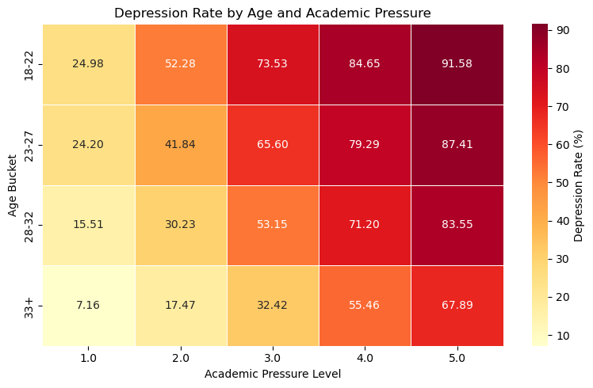
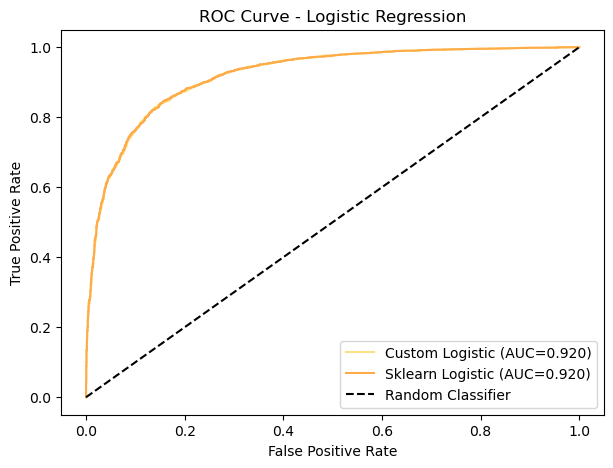

<div align='center'>

# Student Depression Analysis and Prediction using Machine Learning


</div>

This project focuses on analyzing and predicting student depression using machine learning techniques, supported by exploratory data analysis (EDA) of psychological, social, and academic factors. The goal is to derive insights and build classification models that can help identify students potentially facing depression.

---

## 📂 Dataset

**Source:** [Kaggle – Student Depression Dataset](https://www.kaggle.com/datasets/adilshamim8/student-depression-dataset?resource=download) **- Licensed under Apache 2.0 by original authors**

### **Feature Descriptions**
| Feature | Description |
|---------|-------------|
| id | Unique identifier for each student record |
| Gender | Student's gender (Male/Female/Other) |
| Age | Age of the student (in years) |
| City | City or region of residence |
| Profession | Student’s field of work or study |
| Academic Pressure | Level of academic stress faced by the student |
| Work Pressure | Level of work-related stress (for employed students) |
| CGPA | Cumulative Grade Point Average (academic performance) |
| Study Satisfaction | Satisfaction level with studies |
| Job Satisfaction | Satisfaction level with work (if applicable) |
| Sleep Duration | Average daily sleep hours |
| Dietary Habits | Eating and nutrition patterns |
| Degree | Degree/program pursued |
| Suicidal Thoughts | Presence of suicidal thoughts (Yes/No) |
| Work/Study Hours | Average daily work/study hours |
| Financial Stress | Level of financial stress |
| Family History of Mental Illness | Mental illness present in family history (Yes/No) |
| Depression | **Target variable** indicating depression (Yes/No) |

---

## 📊 Current Progress
- ✅ **Data Cleaning**  
  - Removed irrelevant features, handled missing values, encoded categorical variables, scaled numerical features, and split dataset for training/testing.  
- ✅ **EDA**  
  - Completed univariate analysis (age, gender, academic pressure, CGPA, sleep duration, suicidal thoughts, family history, dietary habits, etc.).  
  - Completed bivariate analysis (14 questions including pivot-based grouped plots, stacked bars, heatmaps, and a lollipop plot).  
- 🟡 **Model Building**  
  - **Logistic Regression**:
    - Scikit-learn baseline implemented and evaluated.
    - Custom Logistic Regression built from scratch (gradient descent, loss, sigmoid).
    - Performance validated (ROC-AUC = **0.92**, Accuracy = **84%**, F1 = **87%**).

---

## 📂 Project Structure
```
Student-Depression-Analysis-and-Prediction-using-Machine-Learning/
│
├── data/                   # Dataset
|   └── student_depression_dataset.csv
├── assets/                 # Contains plots and visualization images            
├── notebooks/              # Single consolidated Jupyter notebook
│   └── student_depression_analysis.ipynb
│
├── README.md               # Project overview and documentation
└── LICENSE                 # Project license (MIT)
```

---


## 🔑 Key Insights (from Bivariate Analysis)
- **Gender vs Depression:** Slightly higher depression among males, but not significantly different.  
- **Academic Pressure vs Depression:** Higher academic pressure shows clear association with increased depression.  
- **Age + Financial Stress vs Depression:** Younger students (18–22) with high financial stress are more prone to depression.  
- **Age + CGPA vs Depression:** Lower CGPA in younger groups correlates with higher depression rates.  
- **Top 5 Cities + Gender vs Depression:** Depression rates are similar across top cities for both genders. 
- **Degree vs Depression:** Notable spike for Class 12 students (edge case).  
- **Suicidal Thoughts vs Depression:** Very strong correlation — students with suicidal thoughts show very high depression incidence.  
- **Dietary Habits vs Depression:** Unhealthy eating habits slightly associated with higher depression.  
- **Dietary Habits + Suicidal Thoughts vs Depression:** Combination of unhealthy diet and suicidal thoughts → highest depression rates.

---

## 🔜 Next Steps
- Implement additional models (with scikit-learn comparison):
  1. K-Nearest Neighbors (KNN)
  2. Support Vector Machine (SVM)
  3. Decision Tree
  4. Random Forest
  5. Gradient Boosting
  6. Naive Bayes
  7. Multi-Layer Perceptron (MLP)
  8. XGBoost
- Plot training/loss curves for models.
- Create final summary visualizations:
  - Accuracy vs Epoch (where applicable)
  - ROC-AUC comparisons
  - Final model comparison barplot (Custom vs scikit-learn)
- Deploy the best-performing model as a lightweight app or API.

---

## 🔑 Key Visualizations
  
  

---

## 📜 License
This project is licensed under the [MIT License](./LICENSE).

---

> 🚧 **Work in progress. More models and results coming soon!**


