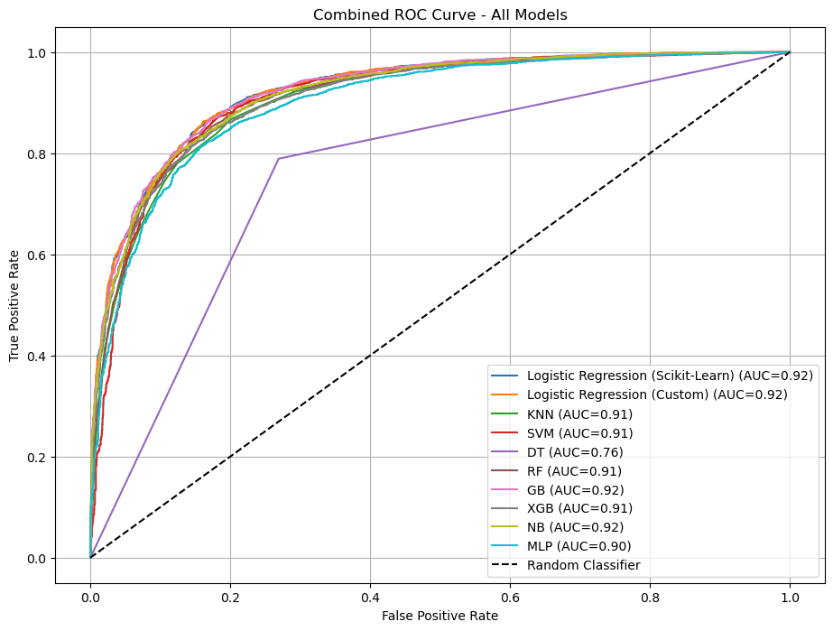
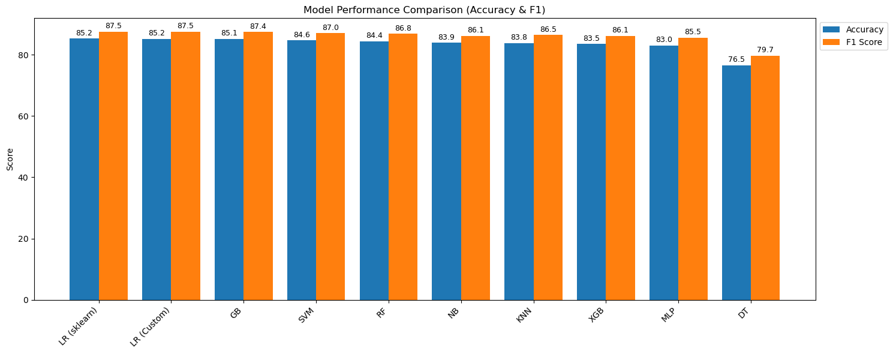

<div align='center'>

# Student Depression Analysis and Prediction using Machine Learning


</div>

This project focuses on analyzing and predicting student depression using machine learning techniques, supported by exploratory data analysis (EDA) of psychological, social, and academic factors. The goal is to derive insights and build classification models that can help identify students potentially facing depression.

---

## 📂 Dataset

**Source:** [Kaggle – Student Depression Dataset](https://www.kaggle.com/datasets/adilshamim8/student-depression-dataset?resource=download) **- Licensed under Apache 2.0 by original authors**

### **Feature Descriptions**
| Feature | Description |
|---------|-------------|
| id | Unique identifier for each student record |
| Gender | Student's gender (Male/Female/Other) |
| Age | Age of the student (in years) |
| City | City or region of residence |
| Profession | Student’s field of work or study |
| Academic Pressure | Level of academic stress faced by the student |
| Work Pressure | Level of work-related stress (for employed students) |
| CGPA | Cumulative Grade Point Average (academic performance) |
| Study Satisfaction | Satisfaction level with studies |
| Job Satisfaction | Satisfaction level with work (if applicable) |
| Sleep Duration | Average daily sleep hours |
| Dietary Habits | Eating and nutrition patterns |
| Degree | Degree/program pursued |
| Suicidal Thoughts | Presence of suicidal thoughts (Yes/No) |
| Work/Study Hours | Average daily work/study hours |
| Financial Stress | Level of financial stress |
| Family History of Mental Illness | Mental illness present in family history (Yes/No) |
| Depression | **Target variable** indicating depression (Yes/No) |

---

## 📂 Project Structure
```
Student-Depression-Analysis-and-Prediction-using-Machine-Learning/
│
├── data/                   # Dataset
|   └── student_depression_dataset.csv
├── assets/                 # Contains plots and visualization images            
├── notebooks/              # Single consolidated Jupyter notebook
│   └── student_depression_analysis.ipynb
│
├── README.md               # Project overview and documentation
└── LICENSE                 # Project license (MIT)
```

---

## ▶ How to Run

### **Requirements**
- Python 3.9+
- Libraries: `numpy`, `pandas`, `matplotlib`, `seaborn`, `scikit-learn`, `xgboost`

### **Steps**

### 1) Clone the repository
```bash
git clone https://github.com/<your-username>/student-depression-prediction.git
cd student-depression-prediction
```

### 2) Install dependencies
```py
pip install numpy pandas matplotlib seaborn scikit-learn xgboost
```
### 3) Open the notebook
```
jupyter notebook notebooks/student_depression_analysis.ipynb
```
---

## 🔑 Key Insights
- **Gender vs Depression:** Slightly higher depression among males, but not significantly different.  
- **Academic Pressure vs Depression:** Higher academic pressure shows clear association with increased depression.  
- **Age + Financial Stress vs Depression:** Younger students (18–22) with high financial stress are more prone to depression.  
- **Age + CGPA vs Depression:** Lower CGPA in younger groups correlates with higher depression rates.  
- **Top 5 Cities + Gender vs Depression:** Depression rates are similar across top cities for both genders. 
- **Degree vs Depression:** Notable spike for Class 12 students (edge case).  
- **Suicidal Thoughts vs Depression:** Very strong correlation — students with suicidal thoughts show very high depression incidence.  
- **Dietary Habits vs Depression:** Unhealthy eating habits slightly associated with higher depression.  
- **Dietary Habits + Suicidal Thoughts vs Depression:** Combination of unhealthy diet and suicidal thoughts → highest depression rates.

---

## 📊 Final Results & Conclusion

| Model                        | Train Accuracy | Test Accuracy | F1 Score | AUC  |
|------------------------------|----------------|---------------|----------|------|
| **Logistic Regression (Sklearn)** | 84.68% | **85.22%** | 87.51% | **0.924** |
| **Custom Logistic Regression**    | 84.56% | 85.16% | **87.52%** | **0.924** |
| Gradient Boosting            | 85.08%         | 85.13%        | 87.44%   | 0.923 |
| Random Forest                | 100%           | 84.42%        | 86.81%   | 0.914 |
| XGBoost                      | 91.53%         | 83.52%        | 86.09%   | 0.912 |
| MLP                          | 88.53%         | 83.0%         | 85.52%   | 0.901 |
| SVM (RBF)                    | 85.58%         | 84.64%        | 87.05%   | 0.912 |
| KNN                          | 84.57%         | 83.76%        | 86.45%   | 0.909 |
| Naive Bayes                  | 83.95%         | 83.90%        | 86.14%   | 0.918 |
| Decision Tree                | 100%           | 76.50%         | 79.72%   | 0.760 |

**Final Takeaway:** **Logistic Regression (Scikit-Learn)** and **Custom Logistic Regression** were the **best-performing models**, combining high accuracy, strong F1 score, and excellent AUC.

---

## 🔑 Key Visualizations

### Depresssion Rate by Age and Academic Pressure - Heatmap


### Combined ROC Curve


### Model Performance Comparison

---

## 📜 License
This project is licensed under the [MIT License](./LICENSE).

---

